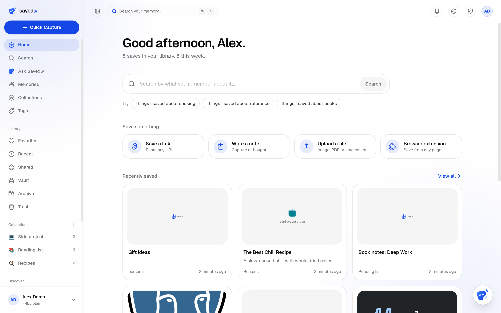

<div align="center">


# Savedly

**Save anything. Ask it anything.**

A personal memory tool that reads, organizes, and helps you find what you save — by keyword or by meaning. Free and open source, with AI features that run on your own API key.

[](./LICENSE)
[](./CONTRIBUTING.md)

[Overview](#overview) • [Features](#features) • [Tech stack](#tech-stack) • [Getting started](#getting-started) • [Bring your own AI key](#bring-your-own-ai-key) • [Project structure](#project-structure) • [Getting help](#getting-help)

</div>

<p align="center">
  
</p>

## Overview

Send Savedly a link, a note, an image, or a document, and it's read, summarized, tagged, and made searchable — automatically, the same pipeline every time, whatever format it came in. Ask it a question in plain English and it answers from what you've actually saved, citing exactly which memory it came from.

Self-host it for free with every feature unlocked and your own AI key, or use the hosted version, where we supply the AI: the Free plan covers the essentials, and Lite and Pro add more room, more AI and features like the private vault.

## Features

- **Capture anything** — links, notes, images, and documents, all through one capture bar
- **Automatic enrichment** — read, summarized, tagged, and embedded on the way in, no manual tagging required
- **Hybrid search** — keyword and meaning-based (semantic) search merged into a single ranked list
- **Ask Savedly** — a chat assistant over your saved content that can also create, edit, organize, and delete memories directly, not just answer questions about them
- **Collections & tags** — organize manually, or let AI file things into a fitting collection automatically
- **Sharing** — public, password-protected, or invite-only links, with per-person access requests
- **Vault** — a PIN-gated space for memories you'd rather keep out of your regular views
- **Calendar sync** — connect Google Calendar or Outlook; AI-detected events push in one click
- **Your own AI key when you self-host** — OpenAI, Anthropic, Groq, Google, or any OpenAI-compatible endpoint (the hosted version supplies the AI)

> [!NOTE]
> On a self-hosted install, semantic search works without a key of your own once the admin sets an instance-wide embeddings key. Everything else (summaries, tags, the Ask assistant) needs a key: each person's own, or one the admin sets up for everyone. See [Bring your own AI key](#bring-your-own-ai-key).

## Tech stack

| App | Stack |
|---|---|
| `server/` | Express + TypeScript, Drizzle ORM (Postgres + `pgvector`), BullMQ, LangGraph |
| `client/` | Next.js 16 (App Router), React, Tailwind CSS |
| `extension/` | Vite + React, Chrome Manifest V3 *(built, not yet published)* |

This is a monorepo of independent apps with **no root workspace** linking them — each has its own `pnpm-workspace.yaml` and lockfile. `cd` into an app directory before installing or running anything.

## Self-host

Run your own Savedly with one command. You need Docker and Git:

```sh
curl -fsSL https://raw.githubusercontent.com/jyotishankar04/saveforlatter/main/install.sh | sh
```

Then open <http://localhost:3000> and create your admin account. It works out of the box with local file storage, the built-in vector store and no email; connect R2/S3, Upstash, SMTP or Google/GitHub sign-in later from **Admin** > **Infrastructure**, or with environment variables. Every feature is unlimited on a self-hosted install. See the [self-hosting guide](./docs/SELF_HOSTING.md).

## Getting started

> [!IMPORTANT]
> Requires [Node.js](https://nodejs.org) and [pnpm](https://pnpm.io). The server also needs Postgres 15+ (with the `pgvector` extension) and Redis — `docker compose up` from `server/` starts both locally, plus Mailhog for local email testing.

```bash
# 1. Server
cd server
pnpm install
cp .env.example .env      # generate the five secrets; the rest can stay empty
docker compose up -d db redis mailhog
pnpm db:bootstrap         # migrations, plus the roles, flags and plans
pnpm dev                  # http://localhost:4000
```

```bash
# 2. Client (in a separate terminal)
cd client
pnpm install
pnpm dev                  # http://localhost:3000
```

```bash
# 3. Extension (optional)
cd extension
pnpm install
pnpm dev
```

Sign up with an email and password (no OAuth app or cloud account needed locally; the first account is an admin), then head to **Settings → AI** to connect a provider key — that's what unlocks summaries, tags, and the Ask assistant. Saving and keyword search both work immediately without one.

## Bring your own AI key

On a self-hosted install, connect a key from **Settings → AI** (on the hosted version we supply the AI, so there's nothing to connect):

| Role | What it powers | Providers |
|---|---|---|
| Fast | Tagging, classification, quick extraction | OpenAI, Anthropic, Groq, Google, or a custom OpenAI-compatible endpoint |
| Reasoning | The Ask assistant, anything needing real judgment | same as above |
| Vision | Reading and describing saved images | same as above |
| Embeddings | Semantic search | same as above — must output exactly 1536-dimensional vectors; covered by a default key if you don't set your own |

Each role can point at a different provider and model, or share one key across several. Every assignment is tested live against the real provider before it's saved.

## Project structure

Start with [`docs/README.md`](./docs/README.md) for the full contributor documentation — a getting-started guide, the architecture, and a reference page per feature. [`CLAUDE.md`](./CLAUDE.md) is a second, denser guide to the same codebase written for AI coding agents, which also works well as a human quick-reference.

```
server/     Express API — feature modules under src/modules/<name>/
client/     Next.js dashboard — app/(marketing)/ and app/(platfrom)/app/
extension/  Chrome MV3 extension — popup, service worker, content script
docs/       Contributor documentation — start at docs/README.md
```

## Getting help

- **Have a question, or want to talk it through?** Join the [Discord server](https://discord.gg/PzGFcMNyRK).
- **Found a bug or want a feature?** [Open an issue](https://github.com/jyotishankar04/saveforlatter/issues) or use the in-app report form (`/report`).
- **Want to contribute code?** See [`CONTRIBUTING.md`](./CONTRIBUTING.md) for setup and PR conventions, and [`CODE_OF_CONDUCT.md`](./CODE_OF_CONDUCT.md) for the ground rules.
- **Anything else?** Email support@savedly.app.
- **Found a security issue?** Please don't open a public issue — see [`SECURITY.md`](./SECURITY.md).

This project is licensed under the [GNU Affero General Public License v3.0](./LICENSE) (AGPL-3.0). You can use, modify and self-host it freely; if you run a modified version as a network service, you must make your source code available to its users under the same license.
